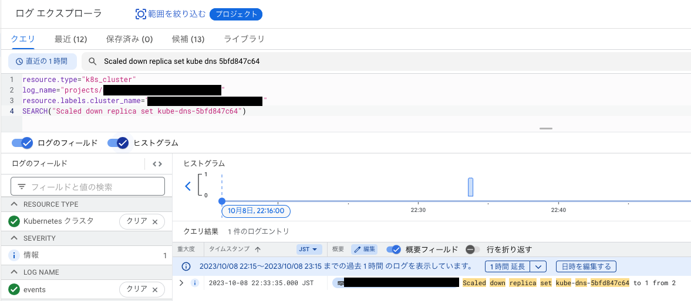
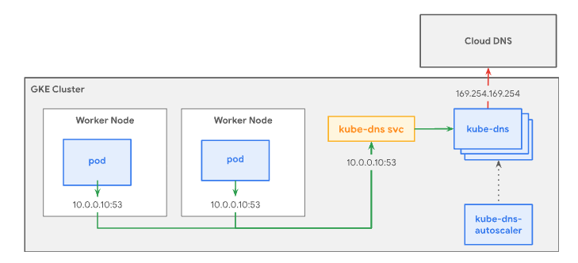
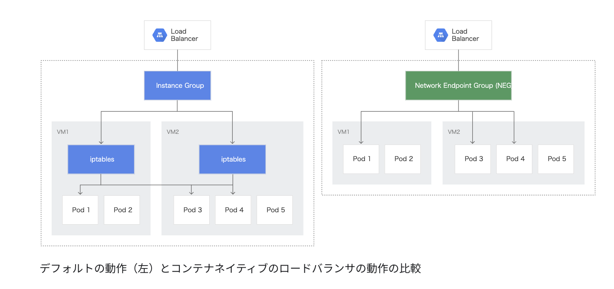

# 最初に

Kubernetes初心者の私は特にNamespace「**kube-system**」にあるリソースについて意識せずに業務を進めていました。  
そこで今回はGKE(Google Cloud Kubernetes Engine)でクラスタ構築時に勝手に作成されるリソースがどのような働きをしているのか雑にまとめてみることにしました。  

まずはクラスタを構築して、、、  特に何もデプロイせずに`k get all`をします。  

<details>
<summary>実行結果</summary>

```bash
❯ k get all -n kube-system
NAME                                                              READY   STATUS    RESTARTS   AGE
pod/event-exporter-gke-7bf6c99dcb-ddh8w                           2/2     Running   0          3m14s
pod/fluentbit-gke-sdpcc                                           2/2     Running   0          2m14s
pod/gke-metrics-agent-mztgr                                       2/2     Running   0          2m14s
pod/konnectivity-agent-69fc69d588-t67rj                           1/1     Running   0          3m3s
pod/konnectivity-agent-autoscaler-5d9dbcc6d8-2qlgw                1/1     Running   0          3m2s
pod/kube-dns-5bfd847c64-p6tgx                                     4/4     Running   0          3m22s
pod/kube-dns-autoscaler-84b8db4dc7-2sjtc                          1/1     Running   0          3m21s
pod/kube-proxy-gke-cn-matsuirut-temp-default-pool-14ae721e-qj9s   1/1     Running   0          72s
pod/l7-default-backend-d86c96845-nj87m                            1/1     Running   0          3m
pod/metrics-server-v0.5.2-6bf74b5d5f-wvrqq                        2/2     Running   0          91s
pod/pdcsi-node-pvztw                                              2/2     Running   0          2m14s

NAME                           TYPE        CLUSTER-IP      EXTERNAL-IP   PORT(S)         AGE
service/default-http-backend   NodePort    10.248.14.194   <none>        80:30274/TCP    2m59s
service/kube-dns               ClusterIP   10.248.0.10     <none>        53/UDP,53/TCP   3m23s
service/metrics-server         ClusterIP   10.248.8.65     <none>        443/TCP         2m50s

NAME                                                    DESIRED   CURRENT   READY   UP-TO-DATE   AVAILABLE   NODE SELECTOR                                                        AGE
daemonset.apps/fluentbit-gke                            1         1         1       1            1           kubernetes.io/os=linux                                               3m12s
daemonset.apps/fluentbit-gke-256pd                      0         0         0       0            0           kubernetes.io/os=linux                                               3m12s
daemonset.apps/fluentbit-gke-max                        0         0         0       0            0           kubernetes.io/os=linux                                               3m12s
daemonset.apps/gke-metrics-agent                        1         1         1       1            1           <none>                                                               3m8s
daemonset.apps/gke-metrics-agent-scaling-10             0         0         0       0            0           <none>                                                               3m8s
daemonset.apps/gke-metrics-agent-scaling-100            0         0         0       0            0           <none>                                                               3m7s
daemonset.apps/gke-metrics-agent-scaling-20             0         0         0       0            0           <none>                                                               3m7s
daemonset.apps/gke-metrics-agent-scaling-200            0         0         0       0            0           <none>                                                               3m7s
daemonset.apps/gke-metrics-agent-scaling-50             0         0         0       0            0           <none>                                                               3m7s
daemonset.apps/gke-metrics-agent-scaling-500            0         0         0       0            0           <none>                                                               3m6s
daemonset.apps/gke-metrics-agent-windows                0         0         0       0            0           kubernetes.io/os=windows                                             3m6s
daemonset.apps/kube-proxy                               0         0         0       0            0           kubernetes.io/os=linux,node.kubernetes.io/kube-proxy-ds-ready=true   2m38s
daemonset.apps/metadata-proxy-v0.1                      0         0         0       0            0           cloud.google.com/metadata-proxy-ready=true,kubernetes.io/os=linux    2m35s
daemonset.apps/nccl-fastsocket-installer                0         0         0       0            0           <none>                                                               2m49s
daemonset.apps/nvidia-gpu-device-plugin-large-cos       0         0         0       0            0           <none>                                                               3m5s
daemonset.apps/nvidia-gpu-device-plugin-large-ubuntu    0         0         0       0            0           <none>                                                               3m4s
daemonset.apps/nvidia-gpu-device-plugin-medium-cos      0         0         0       0            0           <none>                                                               3m6s
daemonset.apps/nvidia-gpu-device-plugin-medium-ubuntu   0         0         0       0            0           <none>                                                               3m5s
daemonset.apps/nvidia-gpu-device-plugin-small-cos       0         0         0       0            0           <none>                                                               3m6s
daemonset.apps/nvidia-gpu-device-plugin-small-ubuntu    0         0         0       0            0           <none>                                                               3m5s
daemonset.apps/pdcsi-node                               1         1         1       1            1           kubernetes.io/os=linux                                               2m46s
daemonset.apps/pdcsi-node-windows                       0         0         0       0            0           kubernetes.io/os=windows                                             2m45s
daemonset.apps/runsc-metric-server                      0         0         0       0            0           kubernetes.io/os=linux,sandbox.gke.io/runtime=gvisor                 3m20s
daemonset.apps/tpu-device-plugin                        0         0         0       0            0           <none>                                                               2m41s

NAME                                            READY   UP-TO-DATE   AVAILABLE   AGE
deployment.apps/event-exporter-gke              1/1     1            1           3m15s
deployment.apps/konnectivity-agent              1/1     1            1           3m4s
deployment.apps/konnectivity-agent-autoscaler   1/1     1            1           3m3s
deployment.apps/kube-dns                        1/1     1            1           3m24s
deployment.apps/kube-dns-autoscaler             1/1     1            1           3m22s
deployment.apps/l7-default-backend              1/1     1            1           3m1s
deployment.apps/metrics-server-v0.5.2           1/1     1            1           2m50s

NAME                                                       DESIRED   CURRENT   READY   AGE
replicaset.apps/event-exporter-gke-7bf6c99dcb              1         1         1       3m15s
replicaset.apps/konnectivity-agent-69fc69d588              1         1         1       3m4s
replicaset.apps/konnectivity-agent-autoscaler-5d9dbcc6d8   1         1         1       3m3s
replicaset.apps/kube-dns-5bfd847c64                        1         1         1       3m23s
replicaset.apps/kube-dns-autoscaler-84b8db4dc7             1         1         1       3m22s
replicaset.apps/l7-default-backend-d86c96845               1         1         1       3m1s
replicaset.apps/metrics-server-v0.5.2-6bf74b5d5f           1         1         1       92s
replicaset.apps/metrics-server-v0.5.2-8569bc4cf9           0         0         0       2m50s
```

</details>

沢山ありますね、一つずつメモレベルでまとめていこうかと思います。  
情報間違っていたらすみません。

## Deployment

### event-exporter-gke

✅ **Cluster で発生した Event をキャプチャし Cloud Logging に送信する**

Kubetenes Cluster内部で実際に発生したEventは`kubectl get event`で取得可能。

```bash
❯ kubectl get event
LAST SEEN   TYPE      REASON             OBJECT               MESSAGE

55s         Normal    ScalingReplicaSet  deployment/kube-dns  Scaled down replica set kube-dns-5bfd847c64 to 1 from 2

```
しかし、これらのEvent情報は発生から1時間後に削除されてしまう。Cluster内部の異常に気づき、後から調査しようと思ったときにはEventのログが消えていた、となると大変だ。  
そこで**event-exporter-gke**の登場。Event情報をLoggingに送信することで後からでもEvent情報を見ることができ、何よりコンソールから容易に検索が可能となる。  



🚨公式docによるとevent-exporterはベストエフォート方式で動作するため、すべてのEventをキャプチャできるとは限らないらしい。トラブルシューティングの際は、Eventに加えてLogsとMetricsを使用することが推奨されている。

参考:  
https://cloud.google.com/stackdriver/docs/solutions/gke/managing-logs?hl=ja

### konnectivity-agent

✅ **コントロールプレーンからクラスタへの通信を安全に**

**Konnectivity** はコントロールプレーンからクラスタへの通信に TCP プロキシを提供するサービスで、コントロールプレーン側に配置された Konnectivity Serverと、クラスタ側に 配置されたKonnectivity Agentの２つの役割から構成されている。  
Konnectivity 登場以前、コントロールプレーンからクラスタ内部への通信には、セキュリティの懸念があるプレーンHTTPや現在非推奨となっているSSHトンネルが利用されていたそう。Konnectivity登場後、**Kubernetes API Server がクラスタ内部に直接接続することがなくなった**ことで、ネットワーキングの分離が可能になり、トラフィックを分割して管理できたりセキュリティの強化ができるようになった。

**konnectivity-agent-autoscaler** は、上記の Konnectivity Agent のスケーリングを制御するものだと認識。

参考:  
https://polar3130.hatenablog.com/entry/2023/05/26/173000  
(参考というかほぼ引用させていただきました)  
https://kubernetes.io/docs/concepts/architecture/control-plane-node-communication/#konnectivity-service

### kube-dns

✅ **GKE クラスタに内蔵されている DNS サーバ**

**kube-dns** は、クラスタ内のコンテナが名前解決できるようDNSの設定を行うクラスタ内のDNSサーバで、Serviceとして動いている。  
アーキテクチャ図は以下。kube-dns Service は、kube-dns Pod をグループ化して、単一の IP アドレス（ClusterIP）を割り振る役割を持っており、デフォルトではクラスタ内のすべての Pod がこの Service を使用して DNS クエリを解決する。  
**kube-dns-autoscaler** は、クラスタの DNS 処理に対応できるように kube-dns をスケーリングする役割を持っている。



各 Pod の DNS 設定は **kubelet** が行っており、kube-dns Service の IPアドレスは各コンテナ内の`etc/resolv.conf`に記述されている。

```bash
❯ k get service kube-dns
NAME       TYPE        CLUSTER-IP   EXTERNAL-IP   PORT(S)         AGE
kube-dns   ClusterIP   10.8.0.10    <none>        53/UDP,53/TCP   9h
```

nameserver に kube-dns の CLUSTER-IPである`10.8.0.10`が書いてある。

```
# cat /etc/resolv.conf
search k8sgpt.svc.cluster.local svc.cluster.local cluster.local asia-northeast1-a.c.{hoge}.internal c.{hoge}.internal google.internal
nameserver 10.8.0.10
options ndots:5
```

参考:  
https://kubernetes.io/ja/docs/concepts/services-networking/dns-pod-service/  
https://cloud.google.com/kubernetes-engine/docs/how-to/kube-dns?hl=ja  
https://gadgeterkun.hatenablog.com/entry/20190630/1561864860  
https://amateur-engineer-blog.com/kubernetes-dns/  

### l7-default-backend

✅ **Ingress Controller のこと**

GKE では、Ingress というオブジェクトで、アプリケーションに HTTP(S) トラフィックをルーティングすることができる。
GKE Ingress Controller によって Cloud HTTP(S) ロードバランサが作成され、Ingress および関連する Service の情報に従って構成を行う。この Ingress Controller の Pod が  **l7-default-backend** で、GKEクラスタの HTTP ロードバランシングが「有効」になっていると起動する。  
この Ingress Controller が NEG(Network Endpoint Groups:`GCE_VM_IP_PORT`)を作成することで、コンテナに対して直接負荷分散を行うことが可能となり、従来にくらべてコンテナに到達するまでのホップ数を減らし、レイテンシーの向上が期待できる「コンテナネイティブの負荷分散」ができるようになる。



どんどん話が大きくなりそうなので一旦ここまで。  

参考:  
https://cloud.google.com/kubernetes-engine/docs/concepts/ingress?hl=ja  
https://cloud.google.com/kubernetes-engine/docs/concepts/container-native-load-balancing?hl=ja  
https://qiita.com/ishii1648/items/a9804d96dea275ee28bd

### metrics-server  

✅ **クラスタのリソースを取得する**

**Metrics Server** は Kubelet からクラスタ内のリソース使用状況を収集し、Metrics API を通じて Kubernetes Api Server で公開する。リソース使用状況を収集することで、自動スケーリングやデバッグが容易になる。  

Metrics API には `kubectl top`でアクセス可能。  
`kubectl describe`コマンドでは Pod が確保したリソースを確認できるのに対し、こちらのコマンドは**実際に Pod 内のコンテナが使用しているリソースの使用量**が確認できる。

```bash
❯ kubectl top pod -n kube-system
NAME                                                          CPU(cores)   MEMORY(bytes)
event-exporter-gke-7bf6c99dcb-ddh8w                           1m           20Mi
fluentbit-gke-sdpcc                                           6m           23Mi
...
```

参考:  
https://github.com/kubernetes-sigs/metrics-server  
<a target="_blank" href="https://www.amazon.co.jp/Kubernetes%25E5%25AE%258C%25E5%2585%25A8%25E3%2582%25AC%25E3%2582%25A4%25E3%2583%2589-%25E7%25AC%25AC2%25E7%2589%2588-Top-Gear-%25E9%259D%2592%25E5%25B1%25B1/dp/4295009792?&_encoding=UTF8&tag=blaaackard04-22&linkCode=ur2&linkId=2ff724fb2dfe8348672a1ebc4673ed32&camp=247&creative=1211">Kubernetes完全ガイド 第2版 (Top Gear)</a>

## Daemonset

全ての Node で動くべき Pod を定義するのが Daemonset 。  
監視やログ収集を行うデーモン等があります。軽く触れていきます。

### fluentbit-gke

✅ **各 Node のコンテナログを Cloud Logging に転送する**

GKE クラスタを作成すると、Cloud Logging および Cloud Monitoring と Cloud Operations for GKE とのインテグレーションがデフォルトで有効になる。  
システムログとアプリケーション ログは、Cloud Logging のログルーターに配信され、Cloud Logging に取り込まれるか、除外されるか、BigQuery、Pub/Sub、Cloud Storage 等にエクスポートされる。  
システム ロギングを有効にすると、fluentbit ベースの専用の Logging エージェントである **fluentbit-gke** が 各ノードに自動的にデプロイされ、ログを Cloud Logging に送信する。

GKE Standard における Node あたりの Pod 数上限は 110  だったが、2022 年 8 月のアップデートで 256 まで引き上げられた。 **fluentbit-gke-256pd** はそれに対応するものという認識。  
いずれかの GKE ノードで 1 秒あたり 100 KiB を超えるログ スループットが必要な場合は、高スループット版の **fluentbit-gke-max** を使用することで、ノードごとに 1 秒あたり 10 MiB という高スループットを実現することができる。


参考:  
https://cloud.google.com/stackdriver/docs/solutions/gke/managing-logs?hl=ja  
https://polar3130.hatenablog.com/entry/2022/08/18/180500  
https://polar3130.hatenablog.com/entry/2022/09/21/090000


### gke-metrics-agent

✅ **Cloud Monitoring にメトリクスを送信する**

Cloud Monitoring にメトリクスを取り込むことで、ダッシュボードでの表示やアラートの生成を行うことができる。**gke-metrics-agent** は各ノードのメトリクスを Cloud Monitoring に送信する役割を持つ。  
gke-metrics-agent-scaling-10 や gke-metrics-agent-scaling-100 があるが、数字は追加するメモリ量(MB)を表している。

参考:  
https://cloud.google.com/stackdriver/docs/solutions/gke/managing-metrics?hl=ja

### kube-proxy

✅ **Service リソースを監視し、ノードのネットワーク設定を行う**

**kube-proxy** は kubelet と同じく、各Node上で動作するコンポーネント。Service リソースの作成/更新/削除を検知した際に、Node のネットワーク設定を行うことで、 ClusterIP や NodePort 宛のトラフィックが Pod に正常に転送されるようにする。  
3つの転送方式があるが、デフォルトは iptables を構成する iptables モード。  
以下参考ページがわかりやすい。

参考: 
https://qiita.com/nozmiz/items/9a74433258a79be26c36  
https://recruit.gmo.jp/engineer/jisedai/blog/kubernetes_service/


### metadata-proxy

✅ **コンテナワークロードに隠蔽されたメタデータを提供する**

GKE ではインスタンスメタデータを使用して VM を構成するが、メタデータの一部は機密性が高くクラスタで実行中のワークロードから保護する必要がある。  
**metadata-proxy**はこの役割を持つものだが、現在ではメタデータ隠蔽は非推奨となっており、**Workload Identity** を使うことが推奨されている。

参考:  
https://cloud.google.com/kubernetes-engine/docs/how-to/protecting-cluster-metadata?hl=ja  
https://github.com/GoogleCloudPlatform/k8s-metadata-proxy  


### nccl-fastsocket-installer

✅ **NVIDIAが提供するマルチGPU向けの集合通信のパフォーマンスを向上させる**

NCCLは、NVIDIAが提供するマルチGPU向けの集合通信用のライブラリで、TensorFlow や PyTorch などのディープラーニングフレームワークでマルチ GPU やマルチノードトレーニングを行う場合に使用される。  
**nccl-fastsocket-installer** は、これらのパフォーマンスを向上させるトランスポート層のプラグインらしい。

参考:  
https://github.com/google/nccl-fastsocket
https://cloud.google.com/compute/docs/gpus/optimize-gpus?hl=ja#fast-socket


### nvidia-gpu-device-plugin

✅ **NVIDIA製のGPUをクラスタで使えるようにする**

Device Plugins とは様々なハードウェアを kubelet に見せるための仕組み。  
GKE上では、NVIDIA Tesla® GPU（K80、P100、P4、V100、T4、L4、A100）を装備したノードプールを作成することができ、画像認識や自然言語処理等のディープラーニングに必要な計算能力を提供する。
**nvidia-gpu-device-plugin** はGKE上で NVIDIA 製の GPU を実行するために必要な plugin 。

参考:  
https://cloud.google.com/kubernetes-engine/docs/how-to/gpus?hl=ja  
https://speakerdeck.com/extendwings/device-pluginkai-fa-ru-men  
https://kubernetes.io/ja/docs/tasks/manage-gpus/scheduling-gpus/  

### pdcsi-node

✅ **Compute Engine 永続ディスクの CSI ドライバ**

GKE を使用するとクラスタへ簡単かつ自動的に Compute Engine 永続ディスク Container Storage Interface（CSI）ドライバをデプロイして管理することができる。標準クラスタでは、Compute Engine 永続ディスクの CSI ドライバを有効にする必要がある。  

詳しく調べてないが、`csi-node-driver-registrar`と`gcp-compute-persistent-disk-csi-driver`という Image が使われていることから、これらに関連するリソースだと思われる。

```bash
❯ kubectl describe daemonsets pdcsi-node --namespace=kube-system
...
Pod Template:
  Labels:           k8s-app=gcp-compute-persistent-disk-csi-driver
  Annotations:      components.gke.io/component-name: pdcsi
                    components.gke.io/component-version: 0.16.14
  Service Account:  pdcsi-node-sa
  Containers:
   csi-driver-registrar:
    Image:      gke.gcr.io/csi-node-driver-registrar:v2.8.0-gke.4@sha256:715a1581ce158fbf95f7ca351e25c7d6a0a1599e46e270e72238cc8a0aef1c43

   gce-pd-driver:
    Image:      gke.gcr.io/gcp-compute-persistent-disk-csi-driver:v1.10.7-gke.0@sha256:a3e4af6b6f6999427dc7b02e813aa1ca5f26e73357c92a77b8fe774ddf431a26
```

詳しくは以下の参考ページ。

参考:  
https://cloud.google.com/kubernetes-engine/docs/how-to/persistent-volumes/gce-pd-csi-driver?hl=ja  
https://github.com/kubernetes-sigs/gcp-compute-persistent-disk-csi-driver  

### runsc-metric-server

あまり良くわかってないが、以下の参考サイトと関連ありそう。

参考:  
https://gvisor.dev/docs/user_guide/observability/

### tpu-device-plugin

調べてもあまり情報が出てこなかったが、nvidia-gpu-device-plugin と同様に GKE上で TPU を実行したい場合に必要な plugin だと認識。

# まとめ

今回は Namespace 「kube-system」 にあるリソースがどのような役割を持っているのかメモベースでまとめてみました。なんとなくの理解がハッキリした理解に変わったり、新しく得た知識もありました。  
まだまだ分からないことだらけですが一つずつ潰していきたいです。  
ありがとうございました。
