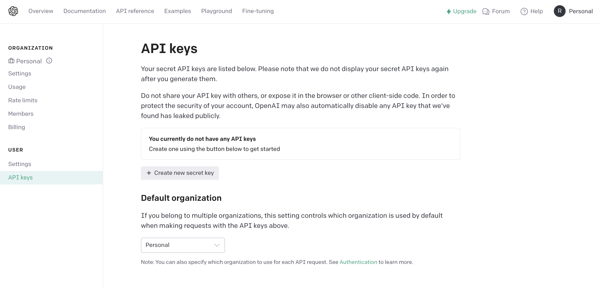

# 最初に

**皆さん、"K8sGPT" 知っていますか？使ったことありますか？**  
GitHub: https://github.com/k8sgpt-ai/k8sgpt/tree/main

Cloud Native Days FUKUOKA 2023に参加した際に、K8sGPTのセッションを聴講して興味を持ったので実際に触ってみました。  
セッション情報: https://event.cloudnativedays.jp/cndf2023/talks/1885

K8sGPT は Kubernetes クラスタ内の問題を探索し、評価、解説するためのツールです。  
システム信頼性エンジニアリング(SRE)の専門知識が組み込まれているため、テクニカルな知識に自信がない人でも容易に使うことができます。  
実行自体は本当にシンプルで`k8sgpt analyze`というコマンドを叩くだけで実行できます。

**実際にクラスタに問題を発生させて検知してもらいましょう！**

## クラスタと問題マニフェストの作成

Kubernetesクラスタの作成が必要な方は作成しましょう。  
また、K8sGPTに問題を検知させるためのマニフェストを準備します。  
今回はノードの割当可能CPUを超過させるようなものをChatGPTに作ってもらいました🤖


<details>
<summary>sample.yaml</summary>

```yaml
apiVersion: apps/v1
kind: Deployment
metadata:
  name: faulty-deployment
  namespace: k8sgpt
spec:
  replicas: 3
  selector:
    matchLabels:
      app: faulty-app
  template:
    metadata:
      labels:
        app: faulty-app
    spec:
      containers:
      - name: faulty-container
        image: nginx:latest
        resources:
          limits:
            memory: "128Mi"
            cpu: "500m"
        ports:
        - containerPort: 8080

---

apiVersion: v1
kind: Service
metadata:
  name: faulty-service
  namespace: k8sgpt
spec:
  selector:
    app: faulty-app
  ports:
    - protocol: TCP
      port: 80
      targetPort: 8080

```

</details>


## CLIのインストール

早速READMEに記載の通りbrewで入れていきます。

```bash
❯ brew tap k8sgpt-ai/k8sgpt
❯ brew install k8sgpt
```

## APIキーの発行

インストールが完了したらAPIキーを発行する必要があります。  
`k8sgpt generate`を打つとOpenAIのページに遷移しました。

🚨**OpenAIのアカウント作成が必要です。**  
🚨**後続の分析ではCreditが必要になります(Min5$から購入できます)。**

```bash
❯ k8sgpt generate

# Opening: https://beta.openai.com/account/api-keys to generate a key for openai
# Please copy the generated key and run `k8sgpt auth` to add it to your config file
```



`+ Create new secret key`を押すとキーの名前を入力するポップアップが出てくるので、適当な名前を入力して`Create secret key`を押します。  
キーが発行されるのでコピーしておきましょう。

## Providerの設定

```bash
❯ k8sgpt auth add -b openai -m gpt-3.5-turbo -p {COPYしたAPIキー}

# openai added to the AI backend provider list
```

ここでいう -bは「backend AI provider」-mは「backend AI model」を意味しています。  
README通りの`k8sgpt auth add`だけだと`k8sgpt analyze`コマンドを使って分析自体はできるのですが、explainやFilterを使おうとすると怒られたので明示的に指定しました。

```bash
❯ k8sgpt auth add
# Warning: backend input is empty, will use the default value: openai
# Warning: model input is empty, will use the default value: gpt-3.5-turbo
Enter openai Key: # openai added to the AI backend provider list

❯ k8sgpt analyze --explain --namespace=k8sgpt
#   0% |                        (0/12, 0 it/hr) [0s:0s]
# Error: failed while calling AI provider openai: error, status code: 400, message: you must provide a model parameter
```

ちなみに今回はOpenAIを指定しましたが、オラクルが支援するCohere等も使えそうでした。

```bash
❯ k8sgpt auth list
# Default:
# > openai
# Active:
# > openai
# Unused:
# > localai
# > azureopenai
# > noopai
# > cohere
```

## いざ分析！

分析自体は`k8sgpt analyze`をたたくだけです。  
--namespace={NAME} や --filter=Pod  など絞り込みもできます。  
Serviceはラベルを貼ろうと言われており、DeploymentはCPUリソースが不足していると言われています。  
ちゃんとCPUに関する分析結果が出力されて安心しました✌

```bash
❯ k8sgpt analyze --namespace=k8sgpt
# AI Provider: openai

# 0 k8sgpt/faulty-service(faulty-service)
# - Error: Service has no endpoints, expected label app=faulty-app
# 1 k8sgpt/faulty-deployment-6879cc8f7f-cntv2(Deployment/faulty-deployment)
# - Error: 0/2 nodes are available: 2 Insufficient cpu. preemption: 0/2 nodes are available: 2 No preemption victims found for incoming pod..
```

--explain をつけることにより、問題のより詳細な説明を得ることができます。

```bash
❯ k8sgpt analyze --explain --namespace=k8sgpt
# 100% |████████████████████████████████| (4/4, 12 it/min)
# AI Provider: openai

# 0 k8sgpt/faulty-service(faulty-service)
# - Error: Service has no endpoints, expected label app=faulty-app
# Error: The service has no endpoints and it is expecting the label app=faulty-app.
# Solution:
# 1. Check the labels of the faulty-app deployment.
# 2. Make sure the labels match the selector in the service definition.
# 3. Update the labels if necessary.
# 4. Restart the deployment and service to apply the changes.
# 1 k8sgpt/faulty-deployment-6879cc8f7f-cntv2(Deployment/faulty-deployment)
# - Error: 0/2 nodes are available: 2 Insufficient cpu. preemption: 0/2 nodes are available: 2 No preemption victims found for incoming pod..
# Error: 0/2 nodes are available: 2 Insufficient cpu. preemption: 0/2 nodes are available: 2 No preemption victims found for incoming pod..
# Solution:
# 1. Check the resource requirements of the pod.
# 2. Increase the CPU limits or request values in the pod's configuration.
# 3. Ensure that the cluster has enough available CPU resources.
# 4. If necessary, add more nodes to the cluster.
# 5. Retry deploying the pod.
```
-l Japanese をつけることで日本語化もできちゃいます。  
「犠牲者が見つかりませんでした。」...機械的な翻訳になってますが意味は理解できますね🙆‍♂️

```bash
❯ k8sgpt analyze --explain -l Japanese --namespace=k8sgpt
# 100% |████████████████████████████████| (4/4, 9 it/min)
# AI Provider: openai

# 0 k8sgpt/faulty-service(faulty-service)
# - Error: Service has no endpoints, expected label app=faulty-app
# Error: サービスにエンドポイントがありません。ラベルapp=faulty-appが期待されています。
# Solution:
# 1. kubectl get svcを使用して現在のサービスを確認します。
# 2. kubectl label svc <service-name> app=faulty-appを使用してサービスにラベルを追加します。
# 3. kubectl get endpointsを使用してエンドポイントが正しく追加されたことを確認します。
# 1 k8sgpt/faulty-deployment-6879cc8f7f-cntv2(Deployment/faulty-deployment)
# - Error: 0/2 nodes are available: 2 Insufficient cpu. preemption: 0/2 nodes are available: 2 No preemption victims found for incoming pod..
# Error: 0/2 ノードが利用可能です: 2 CPU が不足しています。プリエンプション: 0/2 ノードが利用可能です: 2 入力ポッドのプリエンプションの犠牲者が見つかりませんでした。
# Solution:
# 1. クラスタ内のノードの CPU リソースを確認します。
# 2. ノードが十分な CPU を持っていることを確認します。
# 3. もしくは、ポッドの CPU リクエストまたは制限を調整します。
# 4. もしくは、他のノードにポッドをスケジュールします。
```

## 問題を修正して再デプロイ

K8sGPTの分析結果を参考に以下の修正を行います。  
- faulty-serviceにラベルを貼る  
(Solutionでコマンド例を出力してくれてるのでそれ通りに実行します。)

```bash
❯ kubectl label svc faulty-service app=faulty-app -n k8sgpt
# service/faulty-service labeled
```
- faulty-deploymentのCPUリソースリミット値をNodeの割当可能な大きさまで下げる
```yaml
spec:
  containers:
  - name: faulty-container
    image: nginx:latest
    resources:
      limits:
        memory: "128Mi"
        cpu: "500m" # >>"50m"に変更
```

再度分析をすると、、、問題がなくなりました🎉

```bash
❯ k8sgpt analyze --explain -n k8sgpt
#AI Provider: openai

#No problems detected
```

# まとめ

今回はKubernetesクラスタに問題を発生させ、実際にK8sGPTを使用して問題を分析し、修正までをやってみました。  
簡単にクラスタの分析ができることがお分かりいただけたのではないかと思います！  
今回は小規模クラスタ かつ Namespace でフィルターをかけて意図的に分析結果を出してもらいましたが、大規模クラスタの全体検索とかしてみると不適切な設定値のまま放置されているリソースの発見等ができそうですね！  
K8sGPTはまだそこまで一般的になっていませんが、積極的な開発が進んでいます。今後のKubernetes×AIの話題には注目ですね👀

最後まで読んでくださりありがとうございました。

